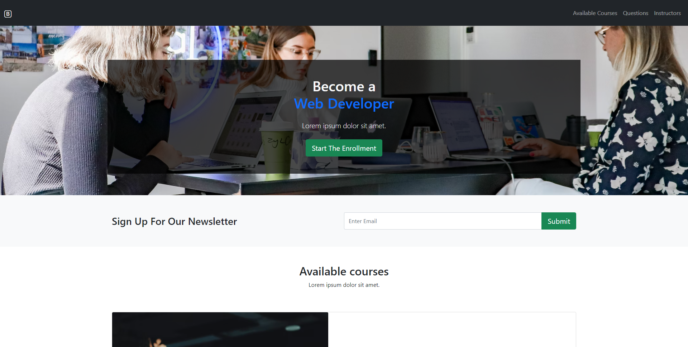
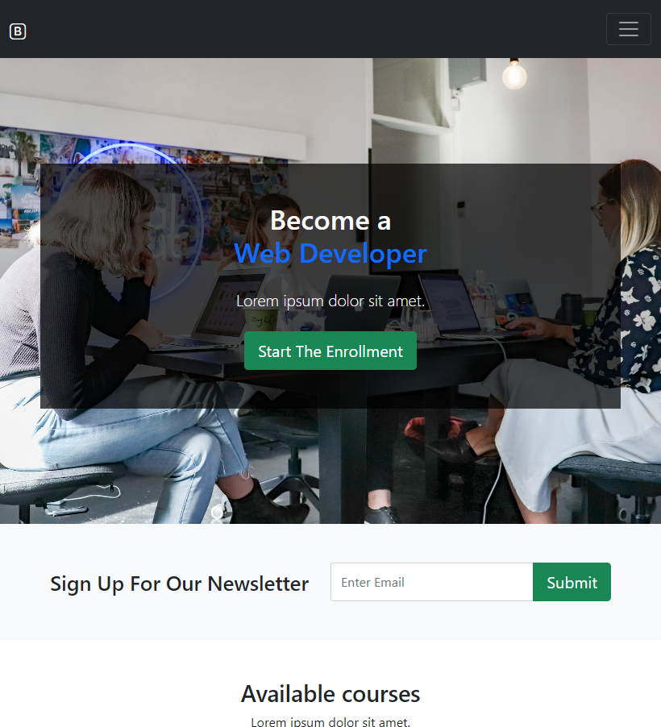
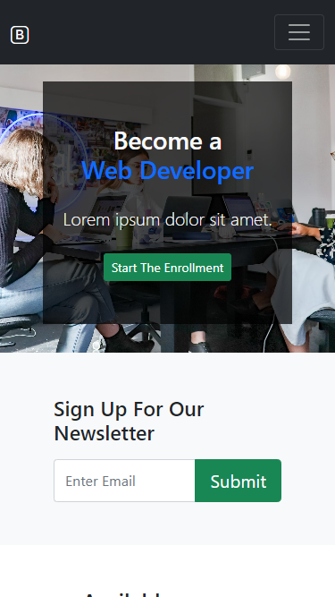

# Overview

Credit to Traversy Media https://www.youtube.com/watch?v=4sosXZsdy-s

This app was built using Bootstrap 5. Once I was comfortable with the framework, I made adjustments to the original project by changing the colours, remaking the hero section and adding a courses section, taking inspiration from the "available programs" section from the website https://codeworks.me/london/ .

The website is fully responsive and has features such as cards, an accordion and modal.

